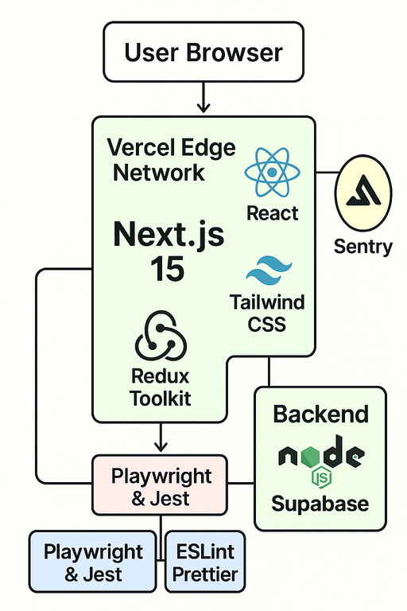

# Proyecto Frontend - Tesis

Este es un proyecto frontend desarrollado con **Next.js 15** para una tesis universitaria. El proyecto utiliza las tecnologías más modernas de desarrollo web.

## 🏗️ Detalle de Arquitectura



### Tabla de Componentes

| Capa / Componente   | Stack                             | Responsabilidad Principal                   |
| ------------------- | --------------------------------- | ------------------------------------------- |
| **UI & Routing**    | Next.js 15 (App Router), React 19 | Renderizado SSR/RSC, rutas nested, layouts  |
| **Estado**          | Context API + Redux Toolkit       | Gestión de estado global y lógica asíncrona |
| **Estilos**         | Tailwind CSS 4                    | Diseño utility‑first, theming responsive    |
| **Autenticación**   | `@supabase/auth‑helpers`          | Login social, JWT, protección de rutas      |
| **Consumo API**     | fetch / Axios                     | Requests a Supabase DB y Backend Node       |
| **Build & Hosting** | Vercel (Edge Functions / CDN)     | CI/CD, deployments preview, dominios        |
| **Testing**         | Playwright + Jest                 | Pruebas e2e y unitarias                     |
| **Lint & Quality**  | ESLint, Prettier                  | Estilo y calidad de código                  |

## 🚀 Tecnologías Utilizadas

- **Next.js 15.3.4** – Framework React con App Router y RSC
- **React 19** – Biblioteca de interfaces de usuario
- **TypeScript 5** – Tipado estático
- **Tailwind CSS 4** – Utility‑first CSS
- **Redux Toolkit + Redux** – Gestión de estado y lógica asíncrona
- **supabase-js** – Cliente JS para BD, Auth
- **ESLint + Prettier** – Lint y formato de código
- **Playwright + Jest** – Testing e2e y unitario

## 📋 Requisitos Previos

Antes de ejecutar este proyecto, asegúrate de tener instalado:

- **Node.js** (versión 18.18 o superior)
- **npm** (viene incluido con Node.js)

Puedes verificar si tienes Node.js instalado ejecutando:

```bash
node --version
npm --version
```

## 🛠️ Instalación

1. **Clona el repositorio**:

```bash
git clone https://github.com/andresuisek/tesis-frontend.git
cd tesis-frontend
```

2. **Instala las dependencias**:

```bash
npm install
```

## 🚀 Cómo Ejecutar el Proyecto

### Modo Desarrollo

Para ejecutar el proyecto en modo desarrollo:

```bash
npm run dev
```

El proyecto se ejecutará en [http://localhost:3000](http://localhost:3000)

### Compilación para Producción

Para compilar el proyecto para producción:

```bash
npm run build
```

### Ejecutar en Modo Producción

Para ejecutar la versión compilada:

```bash
npm run start
```

## 📁 Estructura del Proyecto

```
tesis-frontend/
├── src/
│   └── app/
│       ├── globals.css      # Estilos globales
│       ├── layout.tsx       # Layout principal
│       ├── page.tsx         # Página principal
│       └── favicon.ico      # Icono de la aplicación
├── public/                  # Archivos estáticos
├── package.json            # Dependencias y scripts
├── next.config.ts          # Configuración de Next.js
├── tailwind.config.ts      # Configuración de Tailwind CSS
├── tsconfig.json           # Configuración de TypeScript
└── README.md               # Este archivo
```

## 🧪 Scripts Disponibles

- `npm run dev` - Inicia el servidor de desarrollo
- `npm run build` - Compila el proyecto para producción
- `npm run start` - Ejecuta la versión compilada
- `npm run lint` - Ejecuta ESLint para verificar el código

## 🔧 Desarrollo

### Agregar Nuevas Páginas

Para agregar nuevas páginas, crea archivos `page.tsx` en el directorio `src/app/`:

```
src/app/
├── page.tsx          # Página principal (/)
├── about/
│   └── page.tsx      # Página "about" (/about)
└── contact/
    └── page.tsx      # Página "contact" (/contact)
```

### Estilos

El proyecto utiliza **Tailwind CSS**. Puedes:

- Usar clases de Tailwind directamente en tus componentes
- Modificar `src/app/globals.css` para estilos globales
- Crear archivos CSS modules si necesitas estilos específicos

## 🐛 Solución de Problemas

### El proyecto no se inicia

1. Verifica que Node.js esté instalado correctamente
2. Elimina `node_modules` y `package-lock.json`, luego ejecuta `npm install`
3. Verifica que no haya errores en la consola

### Errores de TypeScript

- Revisa que todos los tipos estén correctamente definidos
- Ejecuta `npm run lint` para verificar errores

### Puerto ocupado

Si el puerto 3000 está ocupado, Next.js automáticamente usará el siguiente puerto disponible (3001, 3002, etc.)

## 👨‍💻 Desarrollado para Tesis

Este proyecto fue creado como parte de una tesis universitaria, utilizando las mejores prácticas de desarrollo frontend moderno.

---

**Nota**: Para cualquier duda sobre el proyecto, consulta la documentación oficial de las tecnologías utilizadas o contacta al desarrollador.
