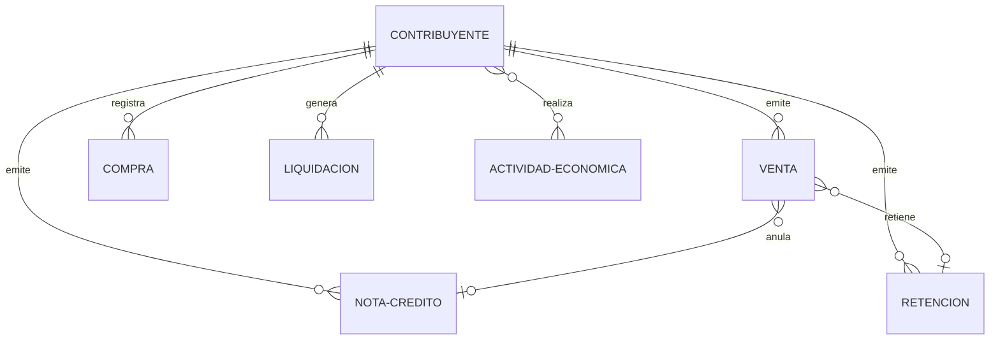

# Diagrama Entidad-Relación - Base de Datos Tributaria

## Diagrama ER Principal

```mermaid
erDiagram
    contribuyentes ||--o| auth_users : "autenticado como"
    contribuyentes ||--o{ contribuyente_actividad : "tiene"
    actividades_economicas ||--o{ contribuyente_actividad : "clasifica"
    contribuyentes ||--o{ ventas : "emite"
    contribuyentes ||--o{ compras : "registra"
    contribuyentes ||--o{ notas_credito : "emite"
    contribuyentes ||--o{ retenciones : "emite"
    contribuyentes ||--o{ tax_liquidations : "genera"
    ventas }o--o| notas_credito : "anula"
    ventas }o--o| retenciones : "retiene"

    contribuyentes {
        char ruc PK
        uuid user_id FK
        varchar first_name
        varchar last_name
        varchar email
        varchar telefono
        text direccion
        enum estado
        enum tipo_obligacion
        smallint cargas_familiares
        boolean obligado_contab
        boolean agente_retencion
        timestamptz created_at
        timestamptz updated_at
    }

    auth_users {
        uuid id PK
        text email
    }

    actividades_economicas {
        varchar codigo PK
        text descripcion
        boolean aplica_iva
    }

    contribuyente_actividad {
        char contribuyente_ruc PK FK
        varchar actividad_codigo PK FK
    }

    ventas {
        uuid id PK
        char contribuyente_ruc FK
        char ruc_cliente
        varchar razon_social_cliente
        date fecha_emision
        enum tipo_comprobante
        varchar numero_comprobante
        numeric subtotal_0
        numeric subtotal_8
        numeric subtotal_15
        numeric iva
        numeric total
        uuid nota_credito_id FK
        uuid retencion_id FK
        timestamptz created_at
    }

    compras {
        uuid id PK
        char contribuyente_ruc FK
        char ruc_proveedor
        varchar razon_social_proveedor
        date fecha_emision
        enum tipo_comprobante
        varchar numero_comprobante
        varchar clave_acceso UK
        enum rubro
        numeric valor_sin_impuesto
        numeric subtotal_0
        numeric subtotal_8
        numeric subtotal_15
        numeric iva
        numeric total
        timestamptz created_at
    }

    notas_credito {
        uuid id PK
        char contribuyente_ruc FK
        date fecha_emision
        enum tipo_comprobante
        varchar numero_comprobante
        numeric subtotal_0
        numeric subtotal_8
        numeric subtotal_15
        numeric iva
        numeric total
        timestamptz created_at
    }

    retenciones {
        uuid id PK
        char contribuyente_ruc FK
        enum tipo_comprobante
        varchar serie_comprobante
        varchar clave_acceso UK
        date fecha_emision
        numeric retencion_iva_percent
        numeric retencion_valor
        numeric retencion_renta_percent
        numeric retencion_renta_valor
        timestamptz created_at
    }

    tax_liquidations {
        uuid id PK
        char contribuyente_ruc FK
        date fecha_inicio_cierre
        date fecha_fin_cierre
        numeric total_compras_iva_0
        numeric total_compras_iva_mayor_0
        numeric total_ventas_iva_0
        numeric total_ventas_iva_mayor_0
        numeric total_nc_iva_mayor_0
        numeric total_retenciones_iva_mayor_0
        numeric credito_favor_adquisicion
        numeric credito_favor_retencion
        numeric impuesto_pagar_sri
        numeric impuesto_causado
        timestamptz created_at
    }
```

## Diagrama Simplificado



## Descripción de las Relaciones

### Cardinalidad

- **||--o{** : uno a muchos (opcional en el lado "muchos")
- **}o--o|** : muchos a uno (opcional en ambos lados)
- **}o--o{** : muchos a muchos (opcional en ambos lados)

### Entidades Principales

**contribuyentes**

- Entidad central del sistema
- Relación 1:1 con auth_users (autenticación Supabase)
- Relación N:M con actividades_economicas
- Relación 1:N con todos los documentos (ventas, compras, retenciones, etc.)

**ventas**

- Facturas emitidas por el contribuyente
- Puede vincularse opcionalmente a una nota_credito (anulación)
- Puede vincularse opcionalmente a una retencion (retención aplicada)

**compras**

- Registro de gastos y compras del contribuyente
- Clasificadas por rubro para deducciones fiscales
- Identificadas por clave_acceso única del SRI

**tax_liquidations**

- Consolida operaciones de un periodo fiscal
- Calcula el impuesto a pagar al SRI

## Tipos ENUM

- **contribuyente_estado**: activo, inactivo
- **tipo_obligacion**: mensual, semestral, anual
- **tipo_comprobante**: factura, nota_credito, liquidacion_compra, retencion, otros
- **rubro_compra**: no_definido, vivienda, alimentacion, salud, educacion, vestimenta, turismo, actividad_profesional

## Estadísticas

| Tabla                  | Registros |
| ---------------------- | --------- |
| Contribuyentes         | 1         |
| Actividades Económicas | 38        |
| Ventas                 | 36        |
| Compras                | 1,787     |
| Retenciones            | 16        |
| Notas de Crédito       | 0         |
| Liquidaciones          | 1         |
