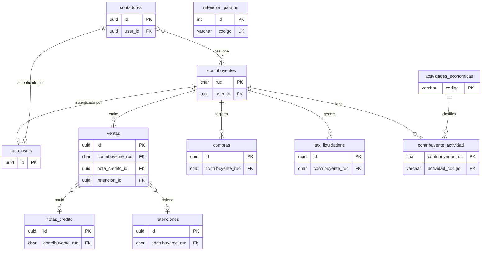

# Diagrama Entidad-Relación - Base de Datos Tributaria

## Diagrama ER

**Figura X.1**
*Diagrama entidad-relación de la base de datos del sistema tributario.*

```mermaid
erDiagram
    contribuyentes ||--o| auth_users : "autenticado por"
    contadores ||--o| auth_users : "autenticado por"
    contribuyentes ||--o{ ventas : "emite"
    contribuyentes ||--o{ compras : "registra"
    contribuyentes ||--o{ tax_liquidations : "genera"
    ventas }o--o| notas_credito : "anula"
    ventas }o--o| retenciones : "retiene"
    contadores }o--o{ contribuyentes : "gestiona"
    contribuyentes ||--o{ contribuyente_actividad : "tiene"
    actividades_economicas ||--o{ contribuyente_actividad : "clasifica"

    auth_users {
        uuid id PK
    }

    contadores {
        uuid id PK
        uuid user_id FK
    }

    contribuyentes {
        char ruc PK
        uuid user_id FK
    }

    ventas {
        uuid id PK
        char contribuyente_ruc FK
        uuid nota_credito_id FK
        uuid retencion_id FK
    }

    compras {
        uuid id PK
        char contribuyente_ruc FK
    }

    tax_liquidations {
        uuid id PK
        char contribuyente_ruc FK
    }

    notas_credito {
        uuid id PK
        char contribuyente_ruc FK
    }

    retenciones {
        uuid id PK
        char contribuyente_ruc FK
    }

    retencion_params {
        int id PK
        varchar codigo UK
    }

    contribuyente_actividad {
        char contribuyente_ruc PK
        varchar actividad_codigo PK
    }

    actividades_economicas {
        varchar codigo PK
    }
```

**Nota.** El gráfico representa el diagrama entidad-relación completo del sistema tributario. Se muestran únicamente las claves primarias (PK) y foráneas (FK) de cada entidad para facilitar la lectura. El detalle completo de los atributos de cada tabla se describe en la siguiente sección.

## Detalle de Atributos por Entidad

### contribuyentes

| Atributo | Tipo | Restricción |
|----------|------|-------------|
| ruc | char(13) | PK |
| user_id | uuid | FK → auth_users.id |
| first_name | varchar | |
| last_name | varchar | |
| email | varchar | |
| telefono | varchar | |
| direccion | text | |
| estado | enum | activo, inactivo |
| tipo_obligacion | enum | mensual, semestral, anual |
| cargas_familiares | smallint | |
| obligado_contab | boolean | |
| agente_retencion | boolean | |
| created_at | timestamptz | |
| updated_at | timestamptz | |
| deleted_at | timestamptz | nullable |

### contadores

| Atributo | Tipo | Restricción |
|----------|------|-------------|
| id | uuid | PK |
| user_id | uuid | FK → auth_users.id, UK |
| first_name | varchar | |
| last_name | varchar | |
| email | varchar | |
| telefono | varchar | nullable |
| direccion | text | nullable |
| numero_registro | varchar | nullable |
| especialidad | varchar | nullable |
| estado | enum | activo, inactivo |
| created_at | timestamptz | |
| updated_at | timestamptz | |
| deleted_at | timestamptz | nullable |

### contador_contribuyente

| Atributo | Tipo | Restricción |
|----------|------|-------------|
| id | uuid | PK |
| contador_id | uuid | FK → contadores.id |
| contribuyente_ruc | char(13) | FK → contribuyentes.ruc |
| estado | enum | activo, inactivo, pendiente |
| fecha_asignacion | timestamptz | |
| fecha_desactivacion | timestamptz | nullable |
| created_at | timestamptz | |
| updated_at | timestamptz | |

### ventas

| Atributo | Tipo | Restricción |
|----------|------|-------------|
| id | uuid | PK |
| contribuyente_ruc | char(13) | FK → contribuyentes.ruc |
| ruc_cliente | char(13) | |
| razon_social_cliente | varchar | |
| fecha_emision | date | |
| tipo_comprobante | enum | |
| numero_comprobante | varchar | |
| subtotal_0 | numeric | |
| subtotal_8 | numeric | |
| subtotal_15 | numeric | |
| iva | numeric | |
| total | numeric | |
| nota_credito_id | uuid | FK → notas_credito.id |
| retencion_id | uuid | FK → retenciones.id |
| created_at | timestamptz | |
| deleted_at | timestamptz | nullable |

### compras

| Atributo | Tipo | Restricción |
|----------|------|-------------|
| id | uuid | PK |
| contribuyente_ruc | char(13) | FK → contribuyentes.ruc |
| ruc_proveedor | char(13) | |
| razon_social_proveedor | varchar | |
| fecha_emision | date | |
| tipo_comprobante | enum | |
| numero_comprobante | varchar | |
| clave_acceso | varchar | UK |
| rubro | enum | |
| valor_sin_impuesto | numeric | |
| subtotal_0 | numeric | |
| subtotal_8 | numeric | |
| subtotal_15 | numeric | |
| iva | numeric | |
| total | numeric | |
| created_at | timestamptz | |
| deleted_at | timestamptz | nullable |

### notas_credito

| Atributo | Tipo | Restricción |
|----------|------|-------------|
| id | uuid | PK |
| contribuyente_ruc | char(13) | FK → contribuyentes.ruc |
| fecha_emision | date | |
| tipo_comprobante | enum | |
| numero_comprobante | varchar | |
| subtotal_0 | numeric | |
| subtotal_8 | numeric | |
| subtotal_15 | numeric | |
| iva | numeric | |
| total | numeric | |
| created_at | timestamptz | |
| deleted_at | timestamptz | nullable |

### retenciones

| Atributo | Tipo | Restricción |
|----------|------|-------------|
| id | uuid | PK |
| contribuyente_ruc | char(13) | FK → contribuyentes.ruc |
| tipo_comprobante | enum | |
| serie_comprobante | varchar | |
| clave_acceso | varchar | UK |
| fecha_emision | date | |
| retencion_iva_percent | numeric | |
| retencion_valor | numeric | |
| retencion_renta_percent | numeric | |
| retencion_renta_valor | numeric | |
| created_at | timestamptz | |
| deleted_at | timestamptz | nullable |

### retencion_params

| Atributo | Tipo | Restricción |
|----------|------|-------------|
| id | integer | PK, autoincrement |
| codigo | varchar | UK |
| descripcion | text | nullable |
| porcentaje | numeric | nullable |
| tipo | varchar | nullable |

### tax_liquidations

| Atributo | Tipo | Restricción |
|----------|------|-------------|
| id | uuid | PK |
| contribuyente_ruc | char(13) | FK → contribuyentes.ruc |
| fecha_inicio_cierre | date | |
| fecha_fin_cierre | date | |
| total_compras_iva_0 | numeric | |
| total_compras_iva_mayor_0 | numeric | |
| total_ventas_iva_0 | numeric | |
| total_ventas_iva_mayor_0 | numeric | |
| total_nc_iva_mayor_0 | numeric | |
| total_retenciones_iva_mayor_0 | numeric | |
| credito_favor_adquisicion | numeric | |
| credito_favor_retencion | numeric | |
| impuesto_pagar_sri | numeric | |
| impuesto_causado | numeric | |
| created_at | timestamptz | |
| deleted_at | timestamptz | nullable |

## Descripción de las Relaciones

### Cardinalidad

- **||--o{** : uno a muchos (opcional en el lado "muchos")
- **}o--o|** : muchos a uno (opcional en ambos lados)
- **}o--o{** : muchos a muchos (opcional en ambos lados)

### Entidades Principales

**contribuyentes**

- Entidad central del sistema
- Relación 1:1 con auth_users (autenticación Supabase)
- Relación N:M con actividades_economicas (a través de contribuyente_actividad)
- Relación N:M con contadores (a través de contador_contribuyente)
- Relación 1:N con todos los documentos (ventas, compras, retenciones, etc.)

**contadores**

- Profesionales que gestionan contribuyentes
- Relación 1:1 con auth_users (autenticación Supabase)
- Relación N:M con contribuyentes (a través de contador_contribuyente)

**ventas**

- Facturas emitidas por el contribuyente
- Puede vincularse opcionalmente a una nota_credito (anulación)
- Puede vincularse opcionalmente a una retencion (retención aplicada)

**compras**

- Registro de gastos y compras del contribuyente
- Clasificadas por rubro para deducciones fiscales
- Identificadas por clave_acceso única del SRI

**retencion_params**

- Tabla de configuración con los códigos y porcentajes de retención
- Utilizada como referencia para el registro de retenciones

**tax_liquidations**

- Consolida operaciones de un periodo fiscal
- Calcula el impuesto a pagar al SRI

## Tipos ENUM

- **contribuyente_estado**: activo, inactivo
- **tipo_obligacion**: mensual, semestral, anual
- **tipo_comprobante**: factura, nota_credito, liquidacion_compra, retencion, otros
- **rubro_compra**: no_definido, vivienda, alimentacion, salud, educacion, vestimenta, turismo, actividad_profesional
- **relacion_estado**: activo, inactivo, pendiente
