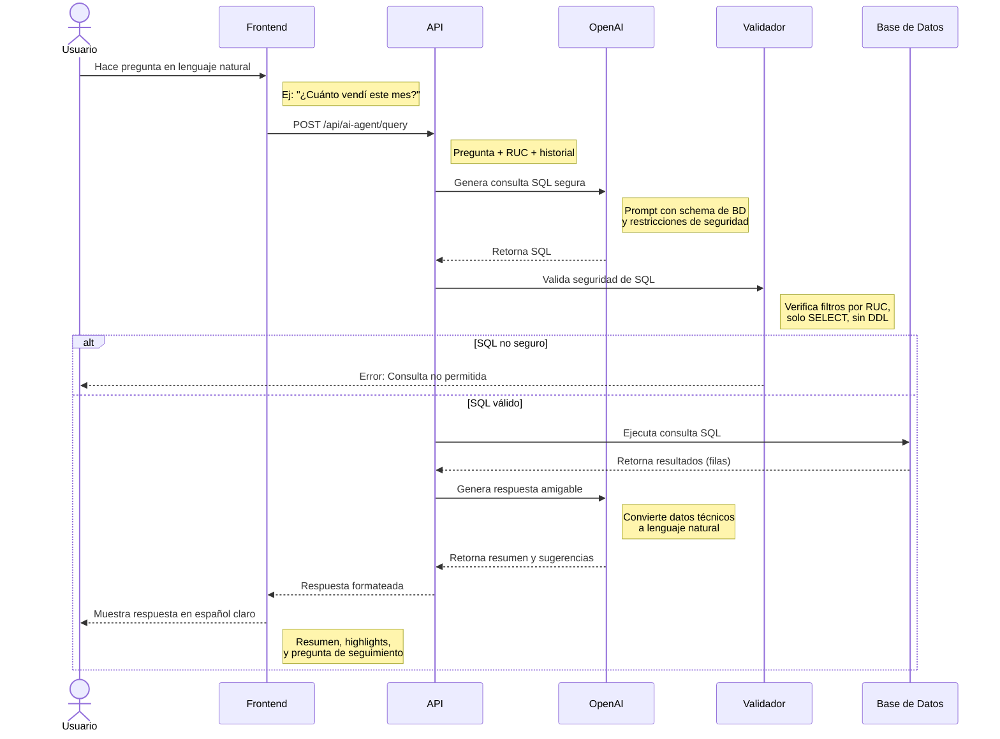

# Diagrama de Secuencia - Asistente Tributario (AI Agent)

Este diagrama muestra cómo funciona el asistente tributario inteligente que permite a los usuarios hacer consultas en lenguaje natural sobre sus datos fiscales.

## Diagrama de Secuencia



## Descripción del Proceso

### 1. Interacción en Lenguaje Natural

El usuario puede hacer preguntas en español coloquial sobre sus datos tributarios, por ejemplo:
- "¿Cuánto vendí este mes?"
- "¿Cuáles son mis principales proveedores?"
- "¿Cuánto debo pagar de IVA?"
- "Muéstrame las compras de octubre"
- "¿Cuál es mi gasto en salud?"

### 2. Generación Inteligente de SQL

El sistema utiliza OpenAI para:
- Interpretar la intención del usuario
- Conocer el esquema de la base de datos
- Generar una consulta SQL optimizada
- Aplicar automáticamente filtros de seguridad

**Contexto proporcionado a OpenAI:**
- Schema completo de la base de datos
- RUC del contribuyente (para filtrado automático)
- Historial de las últimas 3 preguntas (contexto conversacional)
- Fecha actual para referencias temporales ("este mes", "hoy")

### 3. Validación de Seguridad

Antes de ejecutar cualquier consulta, el sistema valida:

#### Restricciones Críticas
- ✅ Solo consultas SELECT (lectura)
- ✅ Debe incluir filtro por `contribuyente_ruc`
- ✅ No se permiten: INSERT, UPDATE, DELETE, DROP, ALTER
- ✅ Límite de 200 filas por consulta
- ✅ No puede acceder a datos de otros contribuyentes

#### Palabras Prohibidas
El validador rechaza consultas que contengan:
- `INSERT`, `UPDATE`, `DELETE`
- `DROP`, `ALTER`, `CREATE`
- `TRUNCATE`, `GRANT`, `REVOKE`
- Inyecciones SQL comunes

### 4. Ejecución y Respuesta

Una vez validada, la consulta se ejecuta y los resultados pasan por dos fases:

#### Fase 1: Obtención de Datos
- Se ejecuta el SQL contra PostgreSQL (Supabase)
- Se obtienen las filas resultantes
- Se limitan a máximo 200 registros

#### Fase 2: Generación de Respuesta Amigable
OpenAI transforma los datos crudos en:
- **Summary**: Resumen en 1-2 párrafos en español claro
- **Highlights**: Puntos clave en formato de viñetas
- **Follow-up**: Sugerencia de próxima pregunta relacionada
- **Preview Rows**: Muestra de los primeros registros

### 5. Presentación al Usuario

El frontend presenta la respuesta de forma estructurada:
- Texto explicativo (sin tecnicismos)
- Tarjetas con datos destacados
- Tabla con preview de resultados
- Sugerencias de seguimiento

## Ejemplos de Uso

### Ejemplo 1: Consulta de Ventas
**Pregunta:** "¿Cuánto vendí en noviembre?"

**SQL Generado:**
```sql
SELECT SUM(total) as total_ventas, COUNT(*) as num_facturas
FROM ventas
WHERE contribuyente_ruc = '1234567890001'
  AND fecha_emision >= '2024-11-01'
  AND fecha_emision < '2024-12-01'
  AND deleted_at IS NULL;
```

**Respuesta:**
> En noviembre de 2024 registraste ventas por un total de $15,234.50 en 42 facturas emitidas. Esto representa un incremento del 12% respecto al mes anterior.

### Ejemplo 2: Análisis de Gastos
**Pregunta:** "¿Cuánto gasté en salud este año?"

**SQL Generado:**
```sql
SELECT SUM(total) as total_salud, COUNT(*) as num_compras
FROM compras
WHERE contribuyente_ruc = '1234567890001'
  AND rubro = 'salud'
  AND fecha_emision >= '2024-01-01'
  AND deleted_at IS NULL;
```

**Respuesta:**
> Tus gastos en salud durante 2024 suman $2,450.30 distribuidos en 15 compras. Esto está dentro del límite deducible de $5,588.17 para tu caso (sin cargas familiares).

## Arquitectura Técnica

### Stack Tecnológico
- **Frontend**: React + TypeScript
- **API**: Next.js API Routes
- **AI**: OpenAI GPT-4 con Structured Outputs
- **Base de Datos**: PostgreSQL (Supabase)
- **Validación**: Expresiones regulares + whitelist

### Flujo de Datos

```
Usuario → Frontend → API Route → OpenAI (SQL Gen)
                              ↓
                         Validador SQL
                              ↓
                    Supabase PostgreSQL
                              ↓
                    OpenAI (Response Gen)
                              ↓
                         Frontend → Usuario
```

### Seguridad Multi-Capa

1. **Capa de Autenticación**: Solo usuarios autenticados
2. **Capa de RUC**: Forzar filtro por contribuyente_ruc
3. **Capa de Validación**: Solo SELECT, sin DDL/DML
4. **Capa de RLS**: Row Level Security en Supabase
5. **Capa de Rate Limiting**: Límite de consultas por minuto

## Ventajas del Sistema

### Para el Usuario
- ✅ No necesita conocer SQL
- ✅ Respuestas en lenguaje natural
- ✅ Contexto conversacional (recuerda preguntas anteriores)
- ✅ Sugerencias inteligentes de seguimiento

### Para el Sistema
- ✅ Seguridad por diseño
- ✅ Escalable (API de OpenAI)
- ✅ Auditable (logs de todas las consultas)
- ✅ Flexible (se adapta a cambios en el schema)

## Limitaciones

- Requiere conexión a internet (OpenAI API)
- Limitado a 200 filas por consulta
- Solo consultas de lectura (SELECT)
- Depende de la calidad del prompt y del modelo

## Permisos

Todos los usuarios autenticados (Usuario y Contador) pueden usar el asistente tributario. El sistema garantiza que cada usuario solo accede a sus propios datos mediante el filtro automático por RUC.

## API Endpoint

**POST** `/api/ai-agent/query`

**Request Body:**
```json
{
  "question": "¿Cuánto vendí este mes?",
  "contribuyenteRuc": "1234567890001",
  "sessionHints": ["pregunta anterior 1", "pregunta anterior 2"]
}
```

**Response:**
```json
{
  "summary": "En diciembre vendiste $5,234.50...",
  "highlights": ["42 facturas emitidas", "IVA cobrado: $628.14"],
  "followUp": "¿Quieres ver el detalle de tus ventas por cliente?",
  "rowCount": 42,
  "previewRows": [...]
}
```


