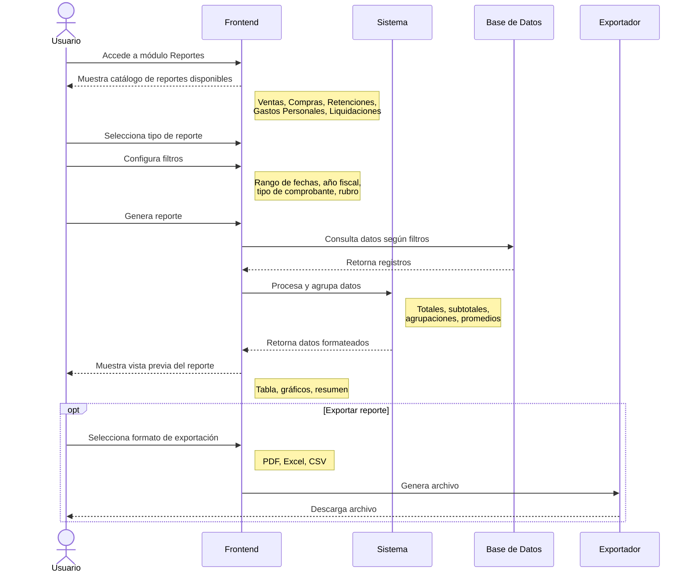

# Diagrama de Secuencia - Consulta de Reportería

Este diagrama muestra el flujo propuesto para el módulo de reportería del sistema tributario.

## Diagrama de Secuencia

## Descripción del Proceso (Propuesto)

### Catálogo de Reportes

El módulo ofrecería los siguientes tipos de reportes:

#### 1. Reporte de Ventas
- Listado de facturas emitidas
- Agrupación por cliente, mes, tipo de comprobante
- Totales de IVA cobrado
- Comparativa con periodos anteriores

#### 2. Reporte de Compras
- Listado de compras registradas
- Agrupación por proveedor, rubro, mes
- Totales de IVA pagado
- Análisis de gastos deducibles

#### 3. Reporte de Retenciones
- Retenciones emitidas y recibidas
- Desglose por tipo (IVA, Renta)
- Totales por periodo

#### 4. Reporte de Gastos Personales
- Distribución por rubro (vivienda, salud, educación, etc.)
- Comparativa con límites de deducción
- Proyección anual

#### 5. Reporte de Liquidaciones
- Historial de cierres tributarios
- IVA causado vs IVA pagado
- Saldos a favor acumulados

### Filtros Disponibles

| Filtro | Descripción |
|--------|-------------|
| Rango de fechas | Fecha inicio y fin |
| Año fiscal | Año completo |
| Mes/Periodo | Mes específico o semestre |
| Tipo de comprobante | Factura, NC, Retención, etc. |
| Rubro de gasto | Para reportes de compras |
| Cliente/Proveedor | Filtro por RUC o nombre |

### Formatos de Exportación

#### PDF
- Documento formateado con logo y membrete
- Ideal para presentación y archivo
- Incluye gráficos y tablas

#### Excel (.xlsx)
- Datos en formato tabular
- Fórmulas de totales
- Ideal para análisis adicional

#### CSV
- Formato plano de texto
- Compatible con cualquier sistema
- Ideal para importación a otros software

### Vista Previa

Antes de exportar, el usuario puede:
- Ver los datos en una tabla interactiva
- Ordenar por cualquier columna
- Filtrar resultados adicionales
- Ver gráficos resumidos
- Verificar totales y subtotales

## Permisos

| Rol | Permisos |
|-----|----------|
| Usuario | Ver y exportar reportes de sus propios datos |
| Contador | Ver y exportar reportes de todos sus clientes asignados |

## Nota

Este módulo está en fase de diseño. El diagrama representa la funcionalidad propuesta para una implementación futura.

