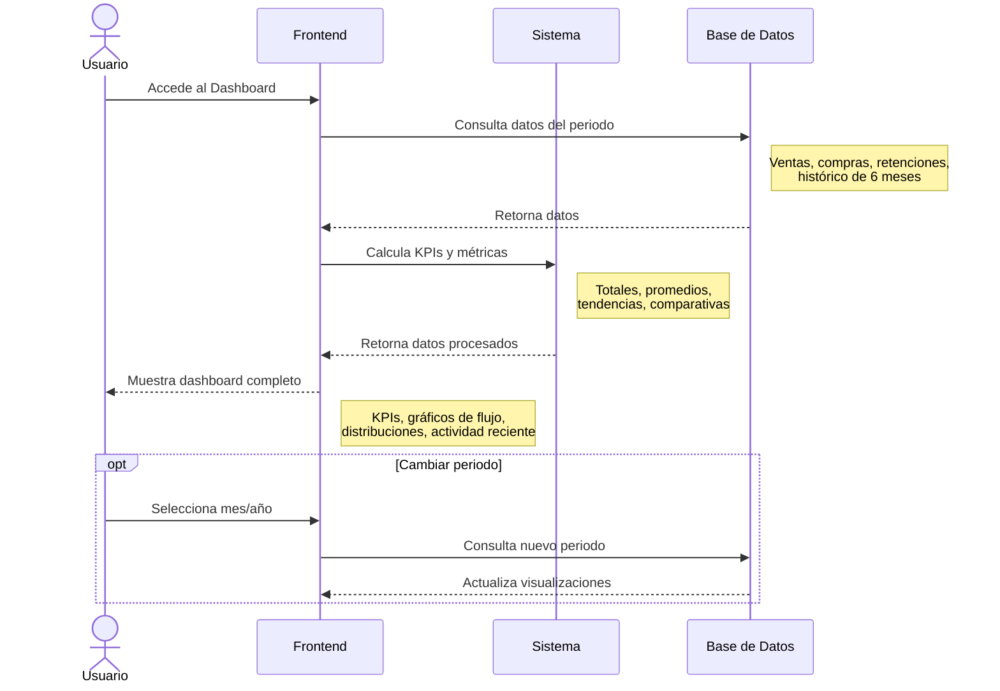

# Diagrama de Secuencia - Dashboard Informativo

Este diagrama muestra cómo funciona el dashboard principal del sistema, que presenta métricas, KPIs y gráficos sobre el desempeño tributario del contribuyente.

## Diagrama de Secuencia



## Descripción del Proceso

### 1. Carga Inicial del Dashboard

Al acceder al dashboard, el sistema:
- Carga automáticamente el periodo actual (mes y año en curso)
- Consulta todas las transacciones del periodo seleccionado
- Obtiene datos históricos de los últimos 6 meses para comparativas

### 2. Consultas a la Base de Datos

El sistema realiza múltiples consultas para obtener:

#### Datos del Periodo Actual
- **Ventas**: Total facturado, número de facturas, IVA cobrado
- **Compras**: Total gastado, número de compras, IVA pagado
- **Retenciones**: Total retenido, número de comprobantes
- **Notas de crédito**: Ajustes y devoluciones

#### Datos Históricos
- Serie temporal de ventas y compras de los últimos 6 meses
- Datos del mes anterior para cálculo de tendencias
- Distribución de gastos por rubros (anual)

### 3. Cálculo de KPIs y Métricas

El sistema procesa los datos brutos y calcula:

#### KPIs Principales
- **Total de Ventas**: Suma del periodo seleccionado
- **Total de Compras**: Suma del periodo seleccionado
- **IVA a Pagar**: IVA cobrado - IVA pagado - Retenciones
- **Retenciones**: Total de retenciones emitidas

#### Indicadores de Tendencia
- Comparación con el mes anterior (% de cambio)
- Identificación de tendencias (positiva/negativa)
- Cálculo de promedios y máximos

#### Datos para Gráficos
- **Flujo Mensual**: Serie temporal de ventas y compras
- **Distribución de IVA**: Desglose por tarifas (0%, 8%, 15%)
- **Gastos por Rubro**: Distribución de gastos personales
- **Distribución de Impuestos**: IVA cobrado vs pagado vs a pagar

### 4. Visualización en el Dashboard

El dashboard presenta la información en varios componentes:

#### Tarjetas de KPIs (4 tarjetas principales)
Cada tarjeta muestra:
- Valor principal del periodo
- Indicador de tendencia con % de cambio
- Color según tendencia (verde = positiva, rojo = negativa)
- Icono representativo

#### Gráficos Interactivos

**1. Gráfico de Flujo Mensual (Area Chart)**
- Muestra ventas y compras de los últimos 6 meses
- Permite comparar visualmente ingresos vs egresos
- Tooltips con valores exactos al hacer hover

**2. Gráfico de Distribución de IVA (Bar Chart)**
- Compara subtotales por tarifa de IVA (0%, 8%, 15%)
- Separa ventas y compras
- Útil para identificar operaciones gravadas vs no gravadas

**3. Gráfico de Gastos por Rubro (Pie Chart)**
- Muestra distribución de gastos personales
- Colores diferenciados por rubro
- Porcentajes y montos absolutos

**4. Gráfico de Distribución de Impuestos (Pie Chart)**
- IVA Cobrado vs IVA Pagado vs Retenciones vs IVA a Pagar
- Visión general de la situación tributaria

#### Actividad Reciente
Lista de las últimas 6 transacciones registradas:
- Tipo de transacción (venta, compra, retención)
- Monto
- Fecha
- Tiempo relativo ("hace 2 días", "hace 1 semana")

### 5. Filtrado por Periodo

El usuario puede cambiar el periodo de análisis:

#### Selector de Año
- Muestra todos los años con datos disponibles
- Carga automáticamente al seleccionar

#### Selector de Mes
- Opción "Ver año completo" para análisis anual
- Meses del 1 al 12
- Al cambiar, recarga todos los datos y gráficos

## Componentes Técnicos

### Hook Personalizado: `useDashboardData`
Centraliza toda la lógica de carga y procesamiento:
- Realiza las consultas a Supabase
- Calcula todos los KPIs
- Genera datos para gráficos
- Maneja estados de carga y errores

### Contexto de Filtros: `DateFilterContext`
Proporciona el periodo seleccionado globalmente:
- Año y mes activos
- Funciones para actualizar filtros
- Sincronización entre componentes

### Componentes de UI
- **MetricCard**: Tarjetas de KPIs con tendencias
- **ChartContainer**: Contenedor de gráficos con tema
- **TaxPeriodFilter**: Selector de periodo fiscal

## KPIs Calculados

### Ventas del Periodo
```
Total Ventas = SUM(ventas.total) WHERE fecha_emision IN periodo
```

### Comparativa con Mes Anterior
```
Cambio % = ((Mes Actual - Mes Anterior) / Mes Anterior) × 100
```

### IVA a Pagar
```
IVA a Pagar = IVA Cobrado - IVA Pagado - Retenciones Recibidas
```

### Promedio por Transacción
```
Promedio = Total Facturado / Número de Facturas
```

## Ventajas del Dashboard

1. **Visión integral**: Todo en una sola pantalla
2. **Comparativas automáticas**: Tendencias mes a mes
3. **Análisis visual**: Gráficos interactivos
4. **Filtros flexibles**: Por mes o año completo
5. **Datos en tiempo real**: Se actualiza con cada registro

## Estados del Dashboard

### Estado de Carga
Muestra un spinner mientras se cargan los datos:
- Icono de carga animado
- Mensaje: "Cargando datos del dashboard..."

### Estado de Error
Si ocurre un error en la consulta:
- Icono de alerta
- Mensaje de error descriptivo
- No muestra datos parciales

### Estado con Datos
Dashboard completo con:
- 4 tarjetas de KPIs
- 4 gráficos interactivos
- Lista de actividad reciente
- Filtros de periodo

## Permisos

Todos los usuarios autenticados (Usuario y Contador) pueden ver el dashboard. Los datos mostrados están filtrados automáticamente por el RUC del contribuyente actual (Row Level Security).

## Periodos de Análisis

- **Vista Mensual**: Datos específicos de un mes (ej: "Noviembre 2024")
- **Vista Anual**: Agregado de todo el año (ej: "Año 2024")
- **Histórico**: Los gráficos siempre muestran los últimos 6 meses

## Datos en Tiempo Real

El dashboard se recarga automáticamente cuando:
- Se cambia el filtro de periodo
- Se navega de vuelta al dashboard después de registrar datos
- El contexto de filtros se actualiza

No requiere refresco manual de la página.


