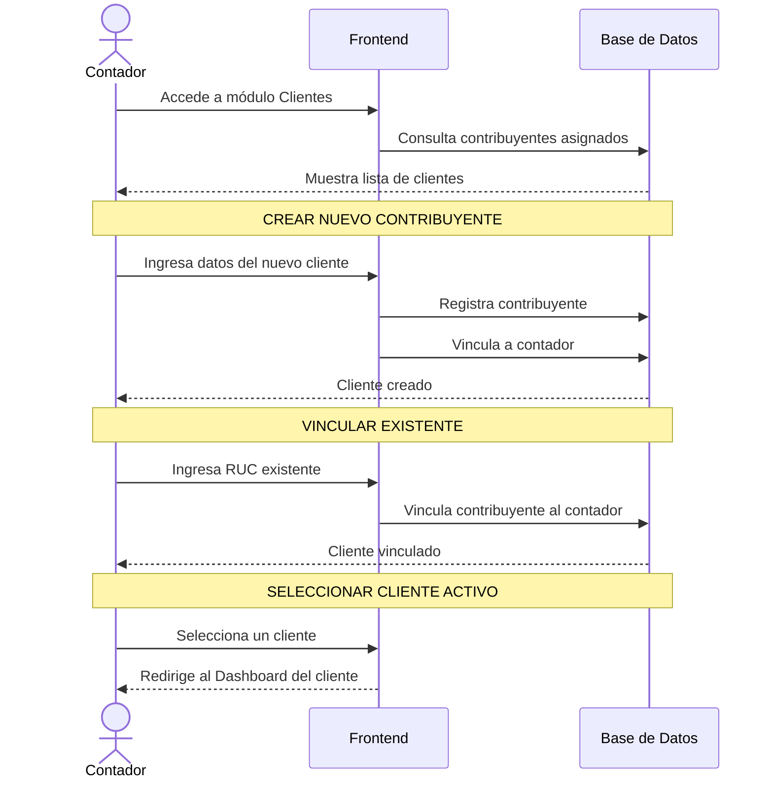

# Diagrama de Secuencia - Gestión de Perfiles de Usuario

Este diagrama muestra cómo el contador gestiona los perfiles de contribuyentes asignados en el sistema.

## Diagrama de Secuencia

## Descripción del Proceso

### Acceso al Módulo de Clientes

Solo los usuarios con rol **Contador** pueden acceder a este módulo. Al ingresar:
- Se carga automáticamente la lista de contribuyentes asignados
- Se muestra un buscador para filtrar por RUC, nombre o email
- Se indica visualmente cuál es el contribuyente activo actual

### Crear Nuevo Contribuyente

El contador puede registrar un nuevo cliente desde cero:

#### Datos Requeridos
- **RUC**: Validación automática del formato ecuatoriano (13 dígitos)
- **Nombre y Apellido**: Datos personales
- **Teléfono y Email**: Información de contacto
- **Dirección**: Ubicación del contribuyente

#### Información Tributaria
- **Cargas Familiares**: Para cálculo de límites de deducciones
- **Obligado a Contabilidad**: Si debe llevar contabilidad formal
- **Agente de Retención**: Si está autorizado a emitir retenciones
- **Tipo de Obligación**: Mensual o semestral

#### Actividades Económicas
- Selección múltiple del catálogo del SRI
- Se registran en la tabla `contribuyente_actividad`

#### Proceso de Creación
1. Se valida el RUC (formato y dígito verificador)
2. Se crea el registro en `contribuyentes`
3. Se registran las actividades económicas
4. Se crea la relación en `contador_contribuyente`

### Vincular Contribuyente Existente

Si el contribuyente ya existe en el sistema (se registró por su cuenta):

#### Flujo
1. El contador ingresa el RUC del contribuyente
2. El sistema busca si existe en la base de datos
3. Si existe, crea la relación en `contador_contribuyente`
4. El contribuyente aparece en la lista del contador

#### Validaciones
- El RUC debe existir en la tabla `contribuyentes`
- No puede haber una relación activa duplicada
- El estado de la relación se establece como "activo"

### Seleccionar Cliente Activo

El contador puede trabajar con múltiples clientes, pero solo uno a la vez:

#### Cambio de Contexto
1. El contador hace clic en "Seleccionar" junto al cliente
2. El sistema actualiza el contexto global (`contribuyenteActivo`)
3. Todos los módulos (ventas, compras, etc.) usan el RUC del cliente activo
4. Se redirige al Dashboard del cliente seleccionado

#### Indicador Visual
- El cliente activo se muestra con un badge "Activo"
- Los demás clientes muestran botón "Seleccionar"

## Tablas Involucradas

### `contadores`
Información del contador profesional:
- `id` - UUID del contador
- `user_id` - Referencia a auth.users
- `first_name`, `last_name` - Nombre del contador
- `email`, `telefono` - Contacto
- `numero_registro` - Registro profesional
- `estado` - activo/inactivo

### `contribuyentes`
Información del contribuyente:
- `ruc` - RUC del contribuyente (PK)
- `user_id` - Referencia a auth.users (opcional)
- Datos personales y tributarios

### `contador_contribuyente`
Relación entre contador y contribuyentes:
- `contador_id` - UUID del contador
- `contribuyente_ruc` - RUC del contribuyente
- `estado` - activo/inactivo/pendiente
- `fecha_asignacion` - Cuándo se creó la relación

### `contribuyente_actividad`
Actividades económicas del contribuyente:
- `contribuyente_ruc` - RUC del contribuyente
- `actividad_codigo` - Código de actividad del SRI

## Permisos y Seguridad

### Row Level Security (RLS)
- Los contadores solo ven los contribuyentes asignados a ellos
- Un contribuyente puede tener múltiples contadores
- Las relaciones inactivas no se muestran en la lista

### Validaciones
- Solo usuarios tipo "contador" pueden acceder al módulo
- El RUC se valida con algoritmo oficial del SRI
- No se permiten RUC duplicados en el sistema

## Estados de la Relación

| Estado | Descripción |
|--------|-------------|
| `activo` | Relación vigente, el contador puede gestionar al contribuyente |
| `inactivo` | Relación terminada, se mantiene para historial |
| `pendiente` | Esperando confirmación del contribuyente (futuro) |

## Interfaz de Usuario

### Lista de Clientes
- Tarjetas con información resumida de cada contribuyente
- Búsqueda en tiempo real
- Indicador de cliente activo
- Botones de acción (Seleccionar, Ver detalles)

### Diálogo de Nuevo Cliente
- Formulario con validación en tiempo real
- Selector múltiple de actividades económicas
- Checkboxes para opciones tributarias

### Diálogo de Vincular
- Campo simple para ingresar RUC
- Validación de existencia en tiempo real
- Mensaje de confirmación o error

