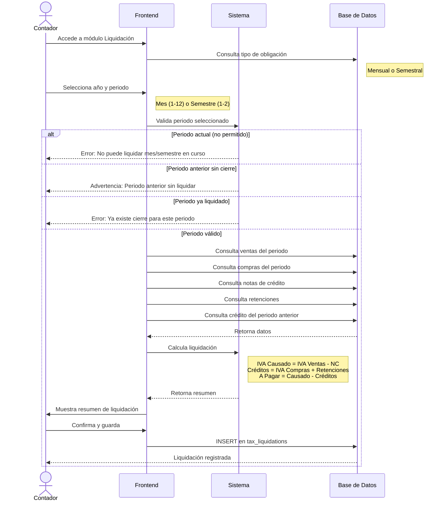

# Diagrama de Secuencia - Liquidación de IVA por Periodicidad

Este diagrama muestra cómo funciona el proceso de liquidación de IVA según el tipo de obligación del contribuyente (mensual o semestral).

## Diagrama de Secuencia



## Descripción del Proceso

### Tipos de Periodicidad

El sistema soporta dos tipos de obligación tributaria:

#### Mensual
- Para contribuyentes con obligación mensual
- Se genera una liquidación por cada mes del año
- Periodo: Primer día al último día del mes

#### Semestral
- Para contribuyentes con obligación semestral
- Se genera una liquidación por semestre
- Primer semestre: Enero - Junio
- Segundo semestre: Julio - Diciembre

### Validaciones de Periodo

Antes de calcular la liquidación, el sistema valida:

| Validación | Resultado |
|------------|-----------|
| Periodo actual (mes/semestre en curso) | ❌ No permitido |
| Periodo anterior sin datos ni cierre | ⚠️ Advertencia (permite continuar) |
| Periodo anterior con datos sin liquidar | ❌ Bloquea hasta liquidar |
| Periodo ya liquidado | ❌ No permite duplicados |
| Periodo válido | ✅ Permite calcular |

### Cálculo de la Liquidación

El sistema obtiene automáticamente los datos del periodo:

#### 1. Separación por Tipo de IVA
- **Ventas IVA 0%**: Subtotales exentos
- **Ventas IVA > 0%**: Subtotales gravados (8% y 15%)
- **Compras IVA 0%**: Subtotales exentos
- **Compras IVA > 0%**: Subtotales gravados

#### 2. Cálculo de IVA Causado
```
IVA Causado = IVA de Ventas - IVA de Notas de Crédito
```

#### 3. Aplicación de Créditos Tributarios
```
Crédito por Adquisición = IVA de Compras
Crédito por Retenciones = Total de retenciones de IVA recibidas
```

#### 4. Arrastre de Crédito del Periodo Anterior
Si existe un cierre del periodo anterior con saldo a favor:
```
Crédito Arrastrado = Saldo a favor del periodo anterior
```

#### 5. Impuesto a Pagar
```
Impuesto a Pagar = IVA Causado - Crédito Adquisición - Crédito Retención - Crédito Arrastrado
```

- Si es **positivo**: Monto a pagar al SRI
- Si es **negativo**: Saldo a favor (se arrastra al siguiente periodo)

### Modos de Creación

#### Liquidación Automática
1. Seleccionar año y periodo
2. El sistema consulta todas las transacciones
3. Calcula automáticamente todos los valores
4. Muestra resumen para revisión
5. El usuario confirma y guarda

#### Liquidación Manual
1. Seleccionar año y periodo
2. El usuario ingresa manualmente:
   - Ventas (IVA 0% e IVA > 0%)
   - Compras (IVA 0% e IVA > 0%)
   - Créditos tributarios
   - Notas de crédito y retenciones
3. El sistema calcula el impuesto a pagar
4. El usuario revisa y confirma

### Resumen de Liquidación

Antes de guardar, el sistema muestra:

| Campo | Descripción |
|-------|-------------|
| Periodo | Mes/Año o Semestre/Año |
| Total Ventas IVA 0% | Ventas exentas |
| Total Ventas IVA > 0% | Ventas gravadas |
| Total Compras IVA 0% | Compras exentas |
| Total Compras IVA > 0% | Compras gravadas |
| IVA Causado | IVA de ventas - NC |
| Crédito Adquisición | IVA de compras |
| Crédito Retención | Retenciones recibidas |
| Crédito Arrastrado | Del periodo anterior |
| **Impuesto a Pagar** | Resultado final |

## Base de Datos

### Tabla: `tax_liquidations`

| Campo | Tipo | Descripción |
|-------|------|-------------|
| `id` | UUID | Identificador único |
| `contribuyente_ruc` | CHAR(13) | RUC del contribuyente |
| `fecha_inicio_cierre` | DATE | Inicio del periodo |
| `fecha_fin_cierre` | DATE | Fin del periodo |
| `total_compras_iva_0` | NUMERIC | Compras IVA 0% |
| `total_compras_iva_mayor_0` | NUMERIC | Compras IVA > 0% |
| `total_ventas_iva_0` | NUMERIC | Ventas IVA 0% |
| `total_ventas_iva_mayor_0` | NUMERIC | Ventas IVA > 0% |
| `total_nc_iva_mayor_0` | NUMERIC | Notas de crédito |
| `total_retenciones_iva_mayor_0` | NUMERIC | Retenciones IVA |
| `credito_favor_adquisicion` | NUMERIC | Crédito por compras |
| `credito_favor_retencion` | NUMERIC | Crédito por retenciones |
| `impuesto_causado` | NUMERIC | IVA causado |
| `impuesto_pagar_sri` | NUMERIC | Impuesto final |
| `created_at` | TIMESTAMPTZ | Fecha de creación |
| `deleted_at` | TIMESTAMPTZ | Soft delete |

## KPIs del Módulo

El módulo muestra indicadores clave:

- **Total a Pagar**: Suma de liquidaciones pendientes
- **Saldo a Favor**: Créditos acumulados
- **IVA Causado**: Total del periodo
- **Crédito Tributario**: Disponible para aplicar

## Permisos

Solo el rol **Contador** puede generar liquidaciones de impuestos. Los usuarios regulares pueden ver el historial de liquidaciones pero no crear nuevas.

## Flujo de Créditos

```
Periodo N-1                    Periodo N                     Periodo N+1
┌─────────────┐               ┌─────────────┐               ┌─────────────┐
│ Saldo Favor │ ──────────▶   │ Crédito     │ ──────────▶   │ Crédito     │
│ $500        │               │ Arrastrado  │               │ Arrastrado  │
└─────────────┘               │ $500        │               │ $XXX        │
                              └─────────────┘               └─────────────┘
```

El saldo a favor de un periodo se arrastra automáticamente como crédito para el siguiente.

