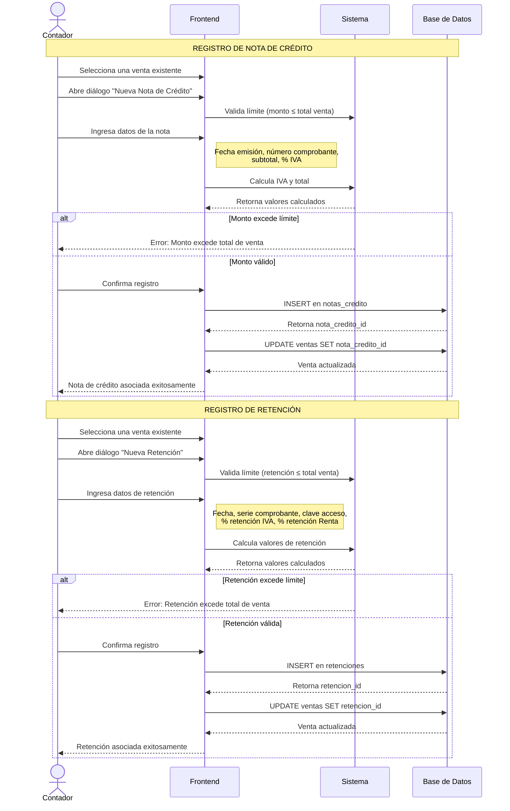

# Diagrama de Secuencia - Comprobantes que Modifican Ventas

Este diagrama muestra cómo se registran y asocian las notas de crédito y retenciones a las ventas existentes.

## Diagrama de Secuencia



## Descripción del Proceso

### Notas de Crédito

Las notas de crédito se utilizan para anular o ajustar ventas ya registradas (devoluciones, descuentos, correcciones).

#### Validaciones
- El monto de la nota de crédito no puede exceder el total de la venta original
- El porcentaje de IVA debe coincidir con el de la venta original
- Cada venta puede tener solo una nota de crédito asociada

#### Campos Requeridos
- **Fecha de emisión**: Fecha del documento
- **Número de comprobante**: Serie del documento
- **Subtotal**: Monto base sin IVA
- **Porcentaje de IVA**: 0%, 8% o 15%
- **IVA y Total**: Se calculan automáticamente

### Retenciones

Las retenciones son comprobantes emitidos por agentes de retención que retienen un porcentaje del IVA y/o Impuesto a la Renta.

#### Validaciones
- El valor total de la retención no puede exceder el total de la venta
- Se valida que los porcentajes sean correctos según normativa SRI
- Cada venta puede tener solo una retención asociada

#### Campos Requeridos
- **Fecha de emisión**: Fecha del comprobante
- **Tipo de comprobante**: Normalmente "retención"
- **Serie del comprobante**: Número de serie
- **Clave de acceso**: Clave electrónica del SRI (opcional, 49 dígitos)
- **Retención IVA**: Porcentaje y valor
- **Retención Renta**: Porcentaje y valor

#### Cálculo de Retenciones
- **Retención IVA**: Puede ser 30%, 70% o 100% del IVA de la venta
- **Retención Renta**: Varía según el tipo de servicio (1%, 2%, 8%, 10%, etc.)

## Flujo de Datos

1. El contador selecciona una venta desde la tabla de ventas
2. El sistema carga los datos de la venta (total, IVA, etc.)
3. El usuario ingresa los datos del comprobante modificador
4. El sistema valida que no se exceda el límite permitido
5. Si es válido, se crea el registro y se vincula a la venta
6. La venta queda marcada con el documento asociado

## Tablas Involucradas

- `ventas` - Tabla principal que contiene las referencias
- `notas_credito` - Registros de notas de crédito
- `retenciones` - Registros de comprobantes de retención

## Relaciones

```
ventas.nota_credito_id → notas_credito.id
ventas.retencion_id → retenciones.id
```

Ambas relaciones tienen `ON DELETE SET NULL`, lo que significa que si se elimina una nota de crédito o retención, la venta no se elimina, solo se desvincula.

## Permisos

Solo el rol **Contador** puede registrar notas de crédito y retenciones. Los usuarios regulares solo pueden visualizar las ventas.

