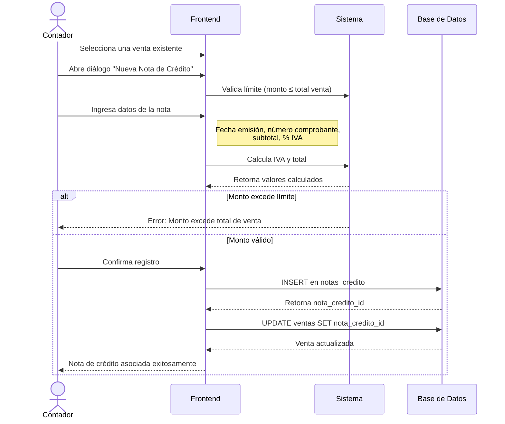

# Diagrama de Secuencia - Registro de Notas de Crédito

Las notas de crédito se utilizan para anular o ajustar ventas ya registradas (devoluciones, descuentos, correcciones).

## Diagrama de Secuencia

**Figura 5.1**
*Diagrama de secuencia del registro de notas de crédito asociadas a ventas existentes.*



**Nota.** El gráfico representa el diagrama de secuencia del registro de notas de crédito que modifican directamente una venta. El sistema valida que el monto no exceda el total de la venta original antes de crear y vincular el comprobante.

## Descripción del Proceso

### Validaciones
- El monto de la nota de crédito no puede exceder el total de la venta original
- El porcentaje de IVA debe coincidir con el de la venta original
- Cada venta puede tener solo una nota de crédito asociada

### Campos Requeridos
- **Fecha de emisión**: Fecha del documento
- **Número de comprobante**: Serie del documento
- **Subtotal**: Monto base sin IVA
- **Porcentaje de IVA**: 0%, 8% o 15%
- **IVA y Total**: Se calculan automáticamente

## Flujo de Datos

1. El contador selecciona una venta desde la tabla de ventas
2. El sistema carga los datos de la venta (total, IVA, etc.)
3. El usuario ingresa los datos de la nota de crédito
4. El sistema valida que el monto no exceda el total de la venta
5. Si es válido, se crea el registro y se vincula a la venta
6. La venta queda marcada con la nota de crédito asociada

## Tablas Involucradas

- `ventas` - Tabla principal que contiene la referencia
- `notas_credito` - Registros de notas de crédito

### Relación

```
ventas.nota_credito_id → notas_credito.id
```

La relación tiene `ON DELETE SET NULL`, lo que significa que si se elimina una nota de crédito, la venta no se elimina, solo se desvincula.

## Permisos

Solo el rol **Contador** puede registrar notas de crédito. Los usuarios regulares solo pueden visualizar las ventas.

