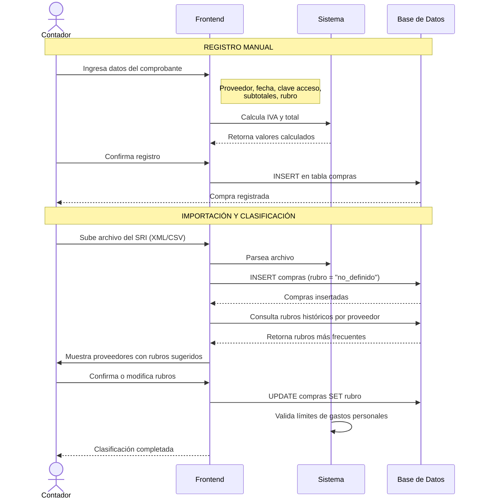

# Diagrama de Secuencia - Registro de Compras y Clasificación de Rubros

Este diagrama muestra el proceso de registro de compras, tanto manual como por importación, y la clasificación de gastos por rubros para deducciones tributarias.

## Diagrama de Secuencia

## Descripción del Proceso

### Registro Manual de Compras

El contador puede registrar compras individualmente ingresando:
- **Datos del proveedor**: RUC y razón social
- **Datos del comprobante**: Fecha de emisión, tipo de comprobante, número, clave de acceso (49 dígitos)
- **Valores tributarios**: Subtotales por tarifa de IVA (0%, 8%, 15%)
- **Clasificación**: Rubro de gasto al momento del registro

El sistema calcula automáticamente el IVA y el total.

### Importación Masiva y Clasificación Inteligente

Para facilitar el registro de múltiples compras, el sistema permite:

#### 1. Importación desde SRI
- El contador sube archivos XML o CSV descargados del portal del SRI
- El sistema parsea y valida los datos automáticamente
- Las compras se registran con rubro inicial "no_definido"

#### 2. Clasificación Automática Inteligente
- El sistema agrupa las compras por proveedor (RUC)
- Consulta el historial de compras anteriores del mismo proveedor
- Analiza la frecuencia de rubros utilizados previamente
- Sugiere el rubro más frecuente para cada proveedor

#### 3. Confirmación y Ajuste
- El contador revisa los rubros sugeridos en una tabla interactiva
- Puede confirmar las sugerencias o modificar rubros manualmente
- Al confirmar, el sistema actualiza todas las compras con sus rubros

#### 4. Validación de Límites
- El sistema calcula los totales por cada rubro
- Valida contra los límites de gastos personales deducibles
- Los límites varían según el número de cargas familiares del contribuyente

## Rubros de Gastos Personales

Según la normativa tributaria ecuatoriana, los rubros deducibles son:

| Rubro | Descripción | Icono |
|-------|-------------|-------|
| **Vivienda** | Arriendos, servicios básicos, impuesto predial | 🏠 |
| **Alimentación** | Supermercados, restaurantes | 🍽️ |
| **Educación** | Matrículas, útiles escolares, uniformes | 🎓 |
| **Salud** | Consultas médicas, medicinas, seguros | 💊 |
| **Vestimenta** | Ropa y calzado | 👕 |
| **Turismo** | Hoteles, agencias de viaje, transporte turístico | ✈️ |
| **Actividad Profesional** | Gastos del ejercicio profesional | 💼 |
| **No Definido** | Sin clasificación | 📄 |

## Límites de Gastos Personales (2025)

Los límites varían según las cargas familiares del contribuyente:

| Cargas Familiares | Límite Anual (USD) |
|-------------------|-------------------|
| 0 | $5,588.17 |
| 1 | $7,184.79 |
| 2 | $8,781.41 |
| 3 | $11,176.34 |
| 4 | $13,571.27 |
| 5+ | $15,966.20 |

El sistema valida automáticamente que los gastos declarados no excedan estos límites.

## Tablas Involucradas

- `compras` - Registro de compras y gastos
- `contribuyentes` - Información del contribuyente (incluye cargas_familiares)

## Campos Principales

### Tabla Compras
- `contribuyente_ruc` - RUC del contribuyente
- `ruc_proveedor` - RUC del proveedor
- `razon_social_proveedor` - Nombre del proveedor
- `fecha_emision` - Fecha del comprobante
- `tipo_comprobante` - Tipo de documento
- `numero_comprobante` - Número de serie
- `clave_acceso` - Clave electrónica del SRI (49 dígitos, único)
- `rubro` - Clasificación del gasto (ENUM)
- `subtotal_0`, `subtotal_8`, `subtotal_15` - Subtotales por tarifa de IVA
- `iva` - Valor del IVA
- `total` - Monto total de la compra

## Ventajas del Sistema de Clasificación

1. **Ahorro de tiempo**: La clasificación automática reduce el trabajo manual
2. **Consistencia**: Mantiene la misma clasificación para proveedores recurrentes
3. **Aprendizaje**: El sistema mejora sus sugerencias con el uso
4. **Control**: El contador siempre puede ajustar manualmente
5. **Cumplimiento**: Validación automática de límites legales

## Permisos

Solo el rol **Contador** puede registrar y clasificar compras. Los usuarios regulares solo pueden visualizar sus propias compras.

