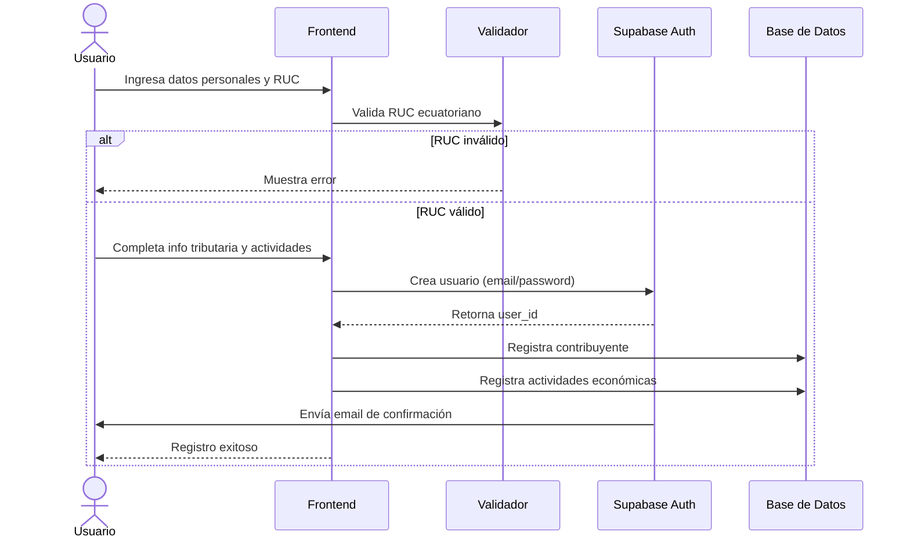

# Diagrama de Secuencia - Registro de Contribuyentes

Este diagrama muestra el flujo completo del proceso de registro de un nuevo contribuyente en el sistema.

## Diagrama de Secuencia

## Descripción del Proceso

### 1. Validación de RUC
- El sistema valida el formato del RUC (13 dígitos)
- Verifica el código de provincia (01-24)
- Valida el dígito verificador según el tipo de contribuyente

### 2. Recopilación de Información
- **Datos personales**: RUC, nombre, apellido, teléfono, email, dirección
- **Información tributaria**: cargas familiares, tipo de obligación, obligado a llevar contabilidad, agente de retención
- **Actividades económicas**: Selección del catálogo de actividades del SRI

### 3. Creación de Cuenta
- Se crea el usuario en Supabase Auth (email/password)
- Se registra el contribuyente en la tabla `contribuyentes`
- Se asocian las actividades económicas seleccionadas en `contribuyente_actividad`

### 4. Confirmación
- Se envía un email de verificación al usuario
- El usuario debe confirmar su email para activar la cuenta completamente

## Tablas Involucradas

- `auth.users` - Sistema de autenticación de Supabase
- `contribuyentes` - Información del contribuyente
- `actividades_economicas` - Catálogo de actividades del SRI
- `contribuyente_actividad` - Relación contribuyente-actividades

