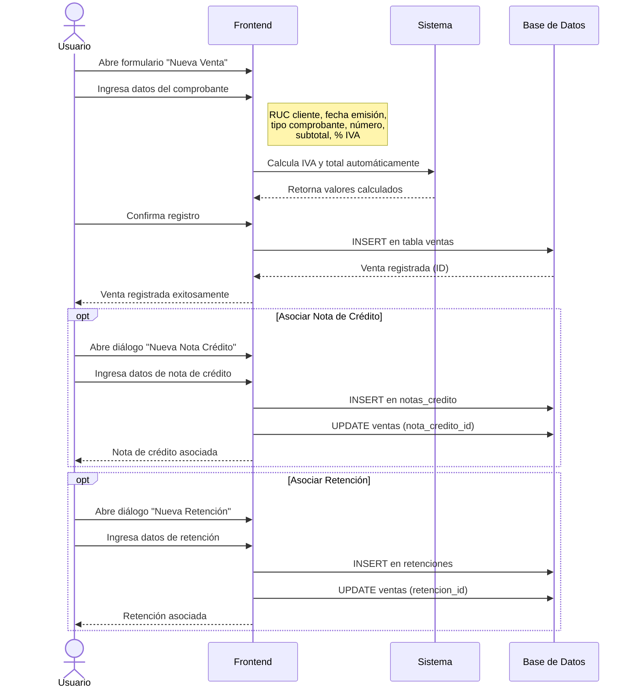

# Diagrama de Secuencia - Registro de Ventas

Este diagrama muestra el flujo completo del proceso de registro de ventas y la asociación de documentos relacionados.

## Diagrama de Secuencia

## Descripción del Proceso

### 1. Registro de Venta
- **Datos del cliente**: RUC y razón social (opcional)
- **Datos del comprobante**: Fecha de emisión, tipo de comprobante, número de comprobante
- **Valores tributarios**: Subtotal y porcentaje de IVA (0%, 8%, 15%)
- **Cálculo automático**: El sistema calcula el IVA y el total basándose en el porcentaje seleccionado

### 2. Asociación de Documentos (Opcional)
Después de registrar una venta, el usuario puede asociar documentos adicionales:

#### Nota de Crédito
- Devoluciones o anulaciones parciales/totales
- Validación: el monto no puede exceder el total de la venta
- Se crea un registro en `notas_credito` y se vincula a la venta

#### Retención
- Comprobantes de retención de IVA y/o Renta
- Incluye: serie, clave de acceso, porcentajes y valores retenidos
- Validación: el total de retención no puede exceder el total de la venta
- Se crea un registro en `retenciones` y se vincula a la venta

## Tablas Involucradas

- `ventas` - Registro principal de facturas emitidas
- `notas_credito` - Notas de crédito emitidas
- `retenciones` - Comprobantes de retención emitidos

## Campos Principales

### Tabla Ventas
- `contribuyente_ruc` - RUC del emisor
- `ruc_cliente` - RUC del cliente
- `fecha_emision` - Fecha del comprobante
- `tipo_comprobante` - Tipo de documento
- `numero_comprobante` - Número de serie del comprobante
- `subtotal_0`, `subtotal_8`, `subtotal_15` - Subtotales por tarifa de IVA
- `iva` - Valor del IVA calculado
- `total` - Monto total de la venta
- `nota_credito_id` - Relación con nota de crédito (si existe)
- `retencion_id` - Relación con retención (si existe)

