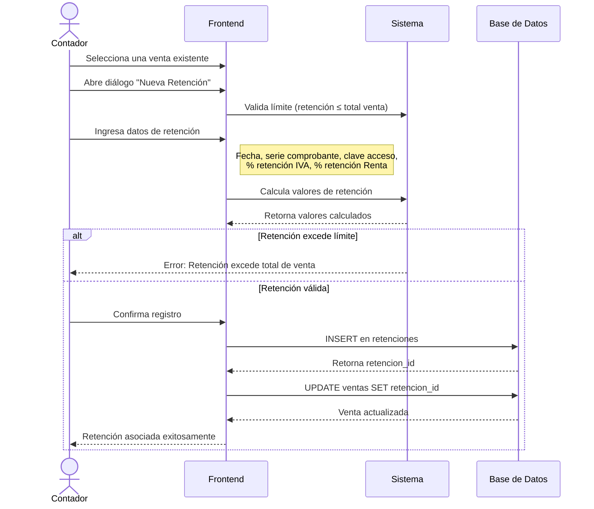

# Diagrama de Secuencia - Registro de Retenciones

Las retenciones son comprobantes emitidos por agentes de retención que retienen un porcentaje del IVA y/o Impuesto a la Renta.

## Diagrama de Secuencia

**Figura 5.2**
*Diagrama de secuencia del registro de retenciones de IVA y Renta asociadas a ventas existentes.*



**Nota.** El gráfico representa el diagrama de secuencia del registro de retenciones de IVA e Impuesto a la Renta que afectan directamente la venta. El sistema calcula y valida los valores de retención según la normativa del SRI antes de vincular el comprobante.

## Descripción del Proceso

### Validaciones
- El valor total de la retención no puede exceder el total de la venta
- Se valida que los porcentajes sean correctos según normativa SRI
- Cada venta puede tener solo una retención asociada

### Campos Requeridos
- **Fecha de emisión**: Fecha del comprobante
- **Tipo de comprobante**: Normalmente "retención"
- **Serie del comprobante**: Número de serie
- **Clave de acceso**: Clave electrónica del SRI (opcional, 49 dígitos)
- **Retención IVA**: Porcentaje y valor
- **Retención Renta**: Porcentaje y valor

### Cálculo de Retenciones
- **Retención IVA**: Puede ser 30%, 70% o 100% del IVA de la venta
- **Retención Renta**: Varía según el tipo de servicio (1%, 2%, 8%, 10%, etc.)

## Flujo de Datos

1. El contador selecciona una venta desde la tabla de ventas
2. El sistema carga los datos de la venta (total, IVA, etc.)
3. El usuario ingresa los datos de la retención
4. El sistema valida que la retención no exceda el total de la venta
5. Si es válido, se crea el registro y se vincula a la venta
6. La venta queda marcada con la retención asociada

## Tablas Involucradas

- `ventas` - Tabla principal que contiene la referencia
- `retenciones` - Registros de comprobantes de retención

### Relación

```
ventas.retencion_id → retenciones.id
```

La relación tiene `ON DELETE SET NULL`, lo que significa que si se elimina una retención, la venta no se elimina, solo se desvincula.

## Permisos

Solo el rol **Contador** puede registrar retenciones. Los usuarios regulares solo pueden visualizar las ventas.

