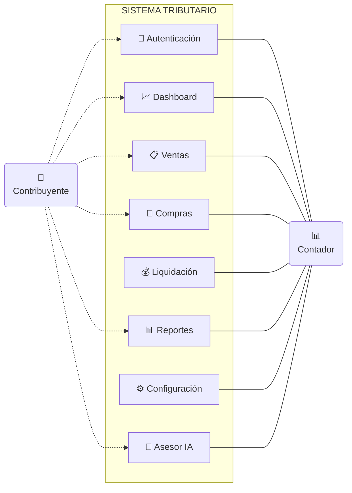

```mermaid
flowchart LR
    U("👤<br/>Contribuyente")

    subgraph Sistema["SISTEMA TRIBUTARIO"]
        direction TB
        A[🔐 Autenticación]
        B[📈 Dashboard]
        C[📋 Ventas]
        D[🛒 Compras]
        E[💰 Liquidación]
        F[📊 Reportes]
        G[🤖 Asesor IA]
        H[⚙️ Configuración]
    end

    C2("📊<br/>Contador")

    U -.-> A
    U -.-> B
    U -.-> C
    U -.-> D
    U -.-> F
    U -.-> G

    A <--- C2
    B <--- C2
    C <--- C2
    D <--- C2
    E <--- C2
    F <--- C2
    H <--- C2
    G <--- C2
```
